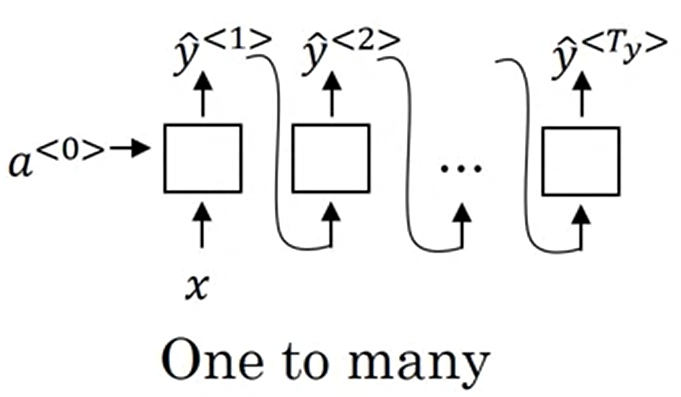

# Next Word Predictor

## Code -- In progress

## Application
**Next Word Predictor** is usefull where we write emails, texts messages, also used in search engines, programming text editors, text documents such as MS Word and many other small applications. This can therefore make our typing easier, efficient and also cut down time. This application is built using **RNN - LSTM** model and **PyTorch** library.

## Algorithms
**RNN - LSTM** is a deep learning **sequence model**. **Recurrent Neural Network(RNN)** is a basic sequence model and for this particular application we use the **one to many architecture**. **Gated Recurrent Unit(GRU)** and **Long Short Term Memorry(LSTM)** are the modified versions of the basic RNN.

> RNN Model

> One to Many RNN Model

**GRU** and **LSTM** is prefered over basic RNN, this is due to **long range connections**(when there is a long sequence of words to be predicted) and **vanishing gradient problem**. These two reasons are taken care of in GRU and LSTM. In **GRU** we have **update and relevance gates** and **memory cell**, which helps in **memorizing** the previous words in the sequence and which helps in **predicting next words more accurately than RNN**. **LSTM** is more **general** and **powerful** than the GRU, it has **update, forget, output gates** and **memory cell**. This allows to separately keep track of **different effective words**(that might affect the next words) for **longer sequence/sentences** and also this makes the **predicted output more accurate than GRU**. 

The main difference between GRU and LSTM during implementation is that **GRU** uses **less training parameters** and therefore use **less memory, execute faster and train faster** than LSTM, whereas LSTM is **more accurate on dataset using longer sequence**. In short, if sequence is large or accuracy is very critical, we can go for LSTM whereas for less memory consumption and faster operation we can go for GRU.

Alongside GRU or LSTM we can also use **Bidirectional RNN** model. This model would help us to **predict** and **re-predict** the words in a sequence after the full sequence is stored or made availabel to the model. This way the model can **correct itself** and **make more accurate predictions**. We also have **Deep RNNs** where **2 or more layers of RNN** are stacked upon each other. This can also be used with GRU, LSTM and Bidirectional RNN but it can make the model computationally more expensive and we use it only when the application needs it. 

## Links to dataset if any used

## How to run your model

**References to produce good readability:**
[Markdown](https://github.com/Learn-Write-Repeat/Open-contributions/blob/master/Markdown.md)
[Jupyter Notebook](https://github.com/Learn-Write-Repeat/Open-contributions/blob/master/Trivedh_Jupyter_Tutorial.md)
